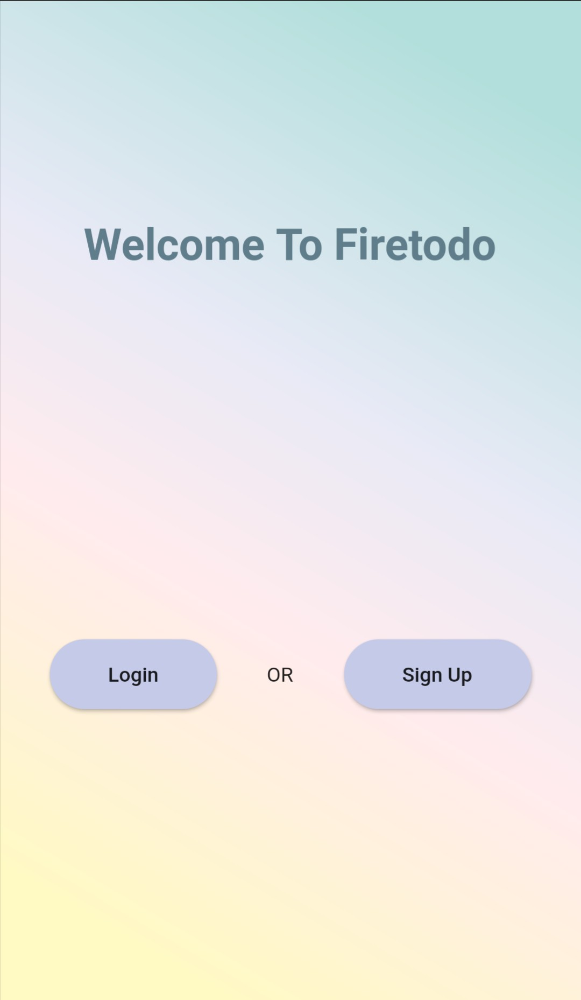
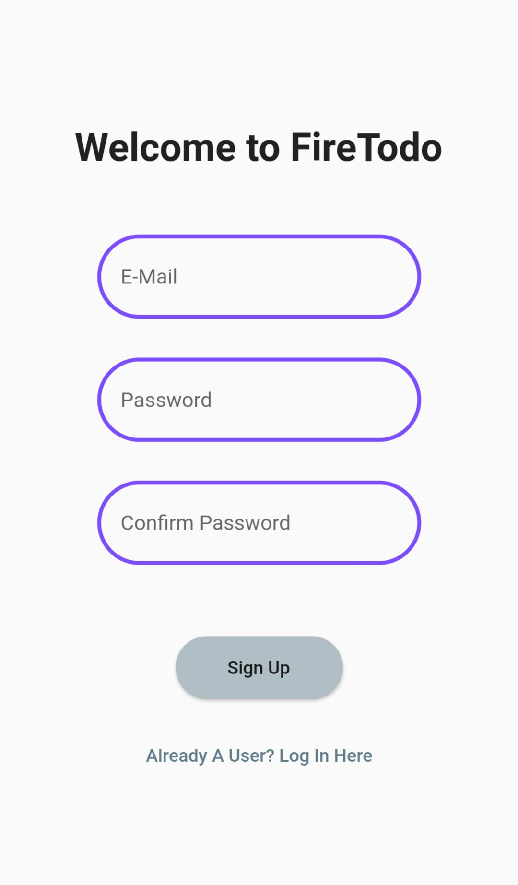
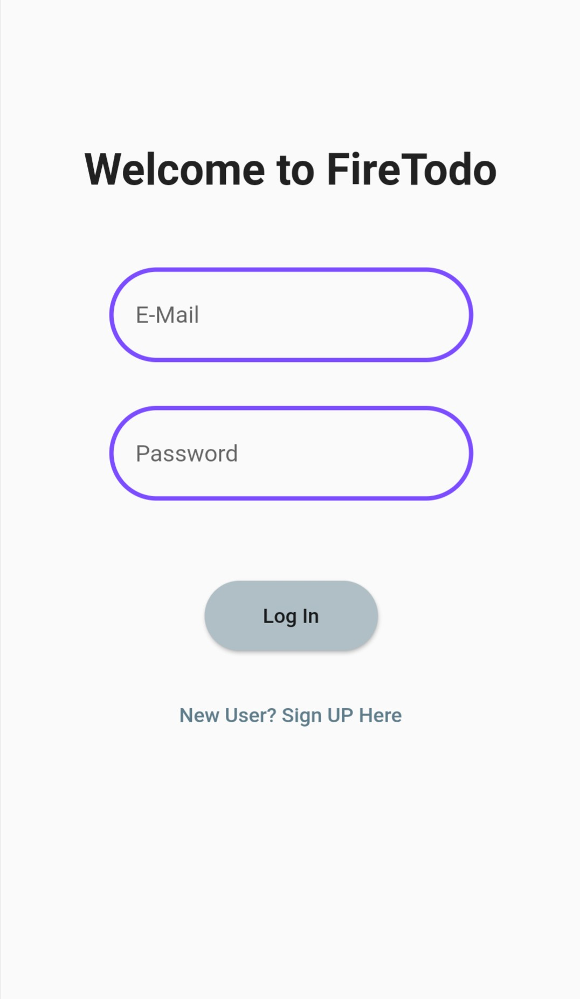
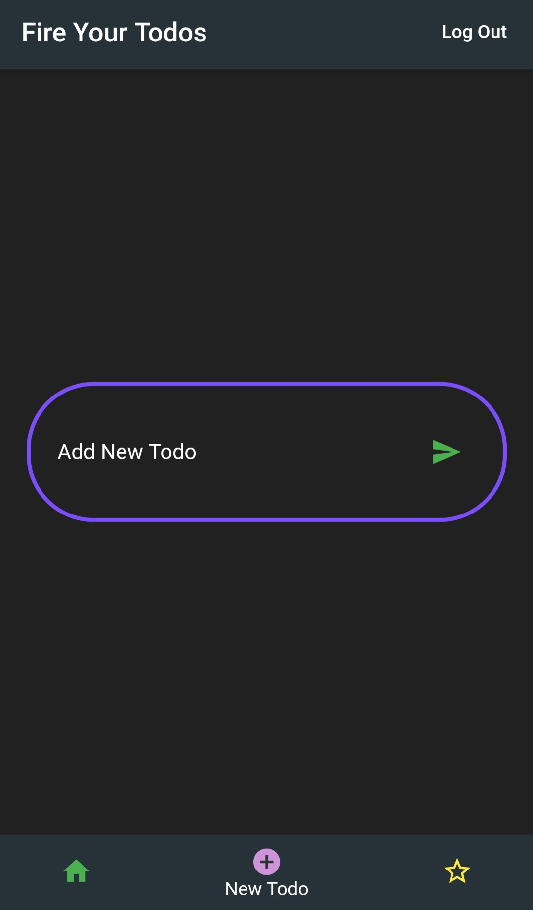
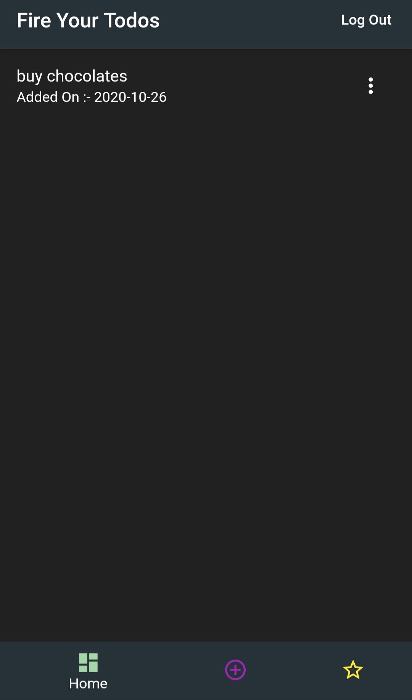
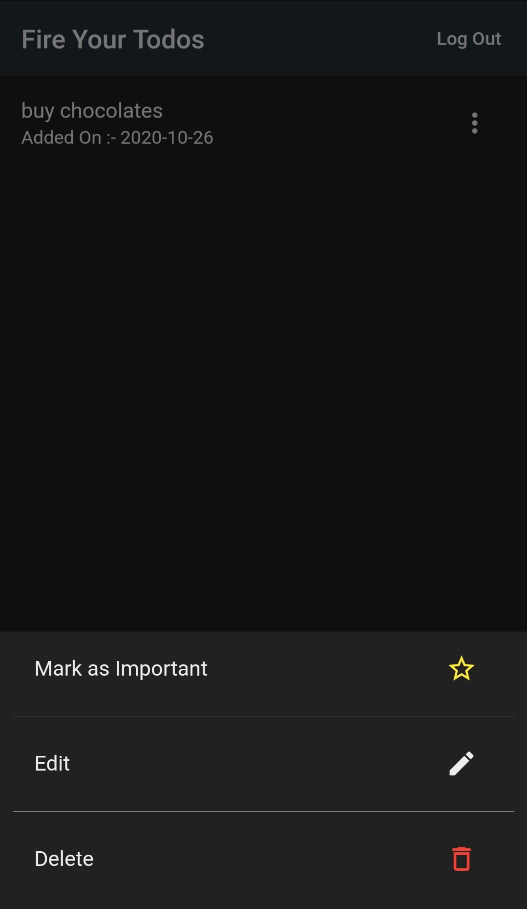
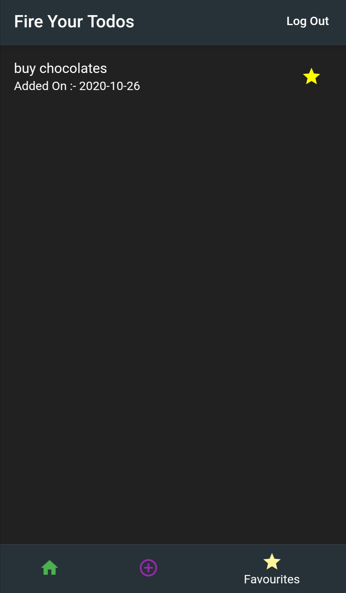

# FireTodo

A Flutter FireBase App to fire your todos.

## Getting Started

This project is a Flutter application which consumes firebase authentication from scratch and firebase realtime database.

<table>
  <tr>
    <td>Home Page</td>
     <td>Sign Up</td>
     <td>Log In</td>
     <td>Add New Todo</td>
  </tr>
  <tr>
    <td valign="top"></td>
    <td valign="top"></td>
    <td valign="top"></td>
    <td valign="top"></td>
  </tr>
  <tr>
     <td>Todo List</td>
     <td>Available Options</td>
     <td>Starred Todos</td>
  </tr>
  <tr>
    <td valign="top"></td>
    <td valign="top"></td>
    <td valign="top"></td>
  </tr>
 </table>
